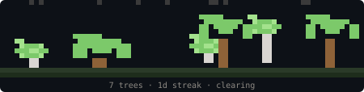

<div align="center">

# Honeytree

**Your codebase is a forest — 3D terminal visualization of any project.**

[](https://www.npmjs.com/package/honeytree)
[](https://github.com/Varun2009178/honeytree/blob/main/LICENSE)

[](https://github.com/Varun2009178/honeytree)

Honeytree scans your project, turns each source file into a 3D tree, and renders the whole thing as a rotatable point-cloud forest in your terminal. Modified files glow amber so you can see what changed at a glance.

</div>

---

## Quick Start

```bash
# 1. Install globally
npm install -g honeytree

# 2. Navigate to any project
cd your-project

# 3. Launch the forest
honeytree
```

That's it. Honeytree scans the current directory, finds all source files, and renders them as a 3D forest you can rotate and explore.

### First time? Here's what to expect:

1. You'll see "Scanning codebase..." briefly
2. The forest appears — each tree is one of your source files
3. Drag your mouse to orbit the camera, scroll or press `+`/`-` to zoom
4. Hover over a tree to see which file it represents (shown in the top bar)
5. Press `q` or `Esc` to exit

> **Tip:** Make sure your terminal supports 24-bit color (iTerm2, Kitty, Windows Terminal, most modern terminals). The default macOS Terminal.app works but colors may look off.

---

## Features

### 3D Point-Cloud Forest

Every source file becomes a tree. Trees are positioned spatially by directory structure — files in the same folder cluster together. The forest is rendered as a true 3D point cloud with perspective projection.

### Interactive Camera

| Control | Action |
|---------|--------|
| Click + drag | Rotate camera (orbit) |
| `+` / `-` | Zoom in / out |
| Arrow keys | Pan camera |
| `q` / `Esc` | Quit |

### Git Diff Review

Honeytree watches for uncommitted changes and highlights modified files in amber. Press `d` to open the split-screen diff panel:

| Key | Action |
|-----|--------|
| `d` | Toggle diff panel |
| `j` / `k` | Navigate between hunks |
| `s` | Stage current hunk |
| `r` | Revert current hunk |
| `Esc` | Close diff panel |

Modified trees are rendered brighter and with an amber glow so they stand out from unchanged code.

### File Hover

Mouse over any tree to see its file path in the top bar. Modified files show a `[modified]` tag.

---

## How It Works

1. **Scan** — walks your project tree, skipping `node_modules`, `.git`, `dist`, etc.
2. **Generate** — assigns each file a 3D position and species based on directory depth, file size, and extension
3. **Render** — projects the point cloud onto your terminal with a perspective camera
4. **Watch** — monitors `git diff` for changes and highlights affected trees in real time

---

## Tree Species

Files are assigned species based on their extension:

| Extension | Species | Look |
|-----------|---------|------|
| `.js`, `.ts` | Oak | Wide, rounded canopy |
| `.py`, `.rb` | Pine | Tall, triangular shape |
| `.html`, `.css` | Birch | Light trunk, bright leaves |
| `.md`, `.txt` | Willow | Drooping canopy |
| `.json`, `.yaml` | Cherry | Pink blossoms |

Larger files produce taller trees. Deeper directories produce trees further from the center.

---

## CLI Reference

| Command | Description |
|---------|-------------|
| `honeytree` | Launch the 3D viewer for current directory |
| `honeytree [dir]` | Launch viewer for a specific directory |
| `honeytree init` | Register Claude Code hook (plants tree per prompt) |
| `honeytree plant` | Plant a tree manually (hook mode) |
| `honeytree badge` | Generate `honeytree-badge.svg` |
| `honeytree md` | Generate `FOREST.md` |

---

## Claude Code Integration

Optionally, Honeytree can also grow a persistent forest that tracks your Claude Code usage:

```bash
honeytree init
```

This registers a [Claude Code hook](https://docs.anthropic.com/en/docs/claude-code/hooks) that plants a tree after every response. Run `honeytree` in a second terminal pane to watch your forest grow in real time.

Features in hook mode:
- **Streaks** — consecutive days of usage tracked in the stats bar
- **Biomes** — forest evolves visually as tree count grows (clearing → grove → woodland → old growth → ancient)
- **Wilting** — miss a day and trees desaturate; plant again to recover

---

## Requirements

- Node.js 18+
- A terminal with 24-bit color support (most modern terminals)
- Git (for diff features)

---

## Links

- **npm**: [npmjs.com/package/honeytree](https://www.npmjs.com/package/honeytree)
- **GitHub**: [github.com/Varun2009178/honeytree](https://github.com/Varun2009178/honeytree)
- **Issues**: [github.com/Varun2009178/honeytree/issues](https://github.com/Varun2009178/honeytree/issues)

## License

MIT
